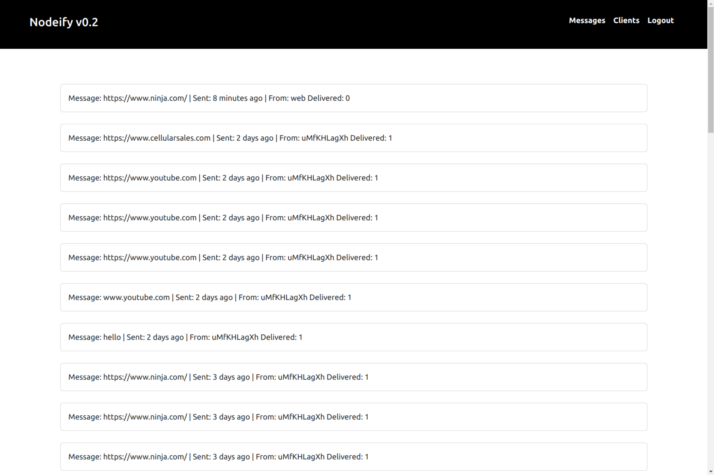

    

<h1 align="center">Nodeify server</h1>

## Intro

Extremely minimal server for sending and receiving messages (in real time via WebSocket).

## Features

- send messages via REST-API
- receive messages via WebSocket
- manage users and clients
- Web-UI
- CLI for sending messages -> [nodeify/cli](https://github.com/tyrone-ward/nodeifycli)
- Android/iPhone apps (coming soon)

---

**Documentation**

COMING SOON

<!-- [Install](https://nodeify.com/docs/install) ᛫
[Configuration](https://nodeify.com/docs/config) ᛫
[REST-API](https://nodeify.com/api-docs) ᛫
[Setup Dev Environment](https://nodeify.com/docs/dev-setup) -->

## Technologies

- **Node.js**: The core environment for running the server-side code.
- **Express**: A web application framework for Node.js, used for server-side routing and middleware logic.
- **better-sqlite3**: A SQLite3 client for Node.js, which provides asynchronous interface for SQLite3 database operations.
- **Argon2**: A library to help hash passwords, enhancing security by encrypting user password data.
- **Handlebars**: A logicless templating language to generate HTML, used for rendering views.
- **Express-session**: Middleware for handling sessions, which is essential for user authentication and management.
- **Validator**: A library of string validators and sanitisers, ensuring data integrity and security.
- **Bootstrap**: A powerful, feature-packed frontend toolkit.

## Issues

I know this project isn't perfect, but this is my first complete project. I will continue to update this project and continue to improve it (mainly because I intend to use it).

## Acknowledgements

This project was **heavily** inspired by [Gotify](https://github.com/gotify/server).

## License

This project is licensed under the MIT License - see the [LICENSE](LICENSE) file for details
